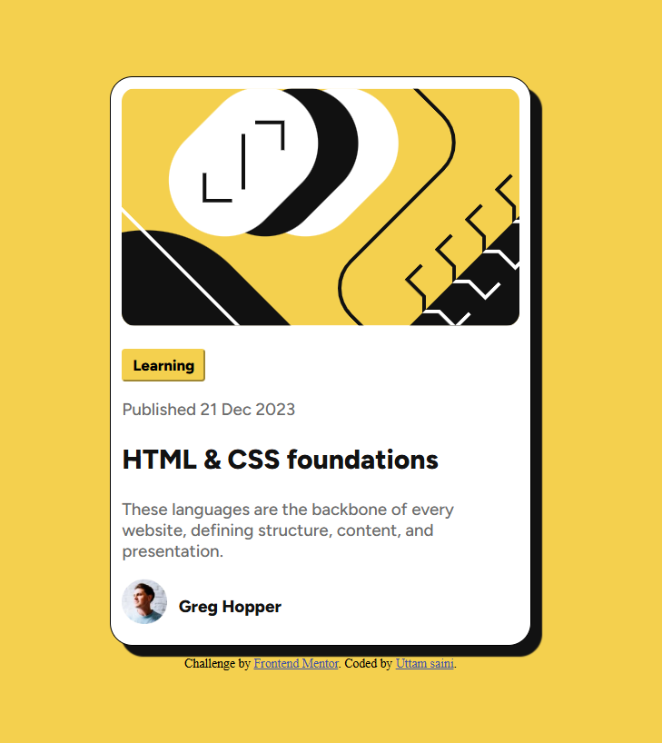

# Frontend Mentor - Blog preview card solution

This is a solution to the [Blog preview card challenge on Frontend Mentor](https://www.frontendmentor.io/challenges/blog-preview-card-ckPaj01IcS). Frontend Mentor challenges help me to improve my coding skills by building realistic projects. 

## Table of contents

- [Overview](#overview)
  - [The challenge](#the-challenge)
  - [Screenshot](#screenshot)
  - [Links](#links)
- [My process](#my-process)
  - [Built with](#built-with)
  - [What I learned](#what-i-learned)
  - [Useful resources](#useful-resources)
- [Author](#author)


## Overview

### The challenge

- The goal is to build a single, responsive component that remains centered in the browser regardless of screen size. We are moving away from "stacking blocks" and toward "designing layouts."

- And See hover and focus states for all interactive elements on the page

### Screenshot




### Links

- Live Site URL: [[Blog preview](https://mini-projects-mqdkiifmq-uttamsaini15s-projects.vercel.app/)].

## My process

<details>
<summary><strong>Phase 1: Folder Structure and Content Scan</strong></summary>

1.  **Create a folder with an `index.html` file, a `style.css` file, and an images folder for your QR code graphic.**
2.  **Look at design. We’ll need a container (the card), an image, a heading (h1 or h2), and a paragraph for the description.**
</details>

<details>
<summary><strong>Phase 2: HTML Structure</strong></summary>

1.  **Keep our HTML semantic and clean. You want a single wrapper to hold everything.**
</details>

<details>
<summary><strong>Phase 3: CSS Styling</strong></summary>

1.  **Start by stripping default margins and picking a clean sans-serif font**
2.  **Give the card a white background, rounded corners, and a fixed or max-width.**
3.  **Make sure the image fits perfectly inside the card.**
4.  **Text Alignment**
</details>

### Built with

- Semantic HTML5 markup
- CSS custom properties
- Flexbox
- CSS Grid
- Mobile-first workflow
- [Font Google](ttps://fonts.google.com) - For styles


### What I learned

```html
<div class="card">
        <div class="img">
          
        </div>
        <div class="text">
          <div class="button">
            <button>Learning</button>
          </div>
          <p>Published 21 Dec 2023</p>
          <h2>HTML & CSS foundations</h2>
          <p>These languages are the backbone of every website, defining structure, content, and presentation.</p>
          <div class="author">
            
            <p>Greg Hopper</p>
          </div>
        </div>
    </div>
```
```css
h2 {
    font-family: "Figtree", sans-serif;
    font-optical-sizing: auto;
    font-weight: 800;
    font-style: normal;
    color: hsl(0, 0%, 7%);
    transition: 0.3s;
    cursor: pointer;
}

h2:hover {
    color: hsl(47, 88%, 63%);
}
```

### Useful resources

- [Google Fonts](https://fonts.google.com/) - This helped me get the targeted fonts. I really liked this and will use it going forward.


## Author

- Website - [Uttam Saini](https://www.linkedin.com/in/uttam-saini-848b66376/)
- Frontend Mentor - [@uttamsaini15](https://www.frontendmentor.io/profile/uttamsaini15)

