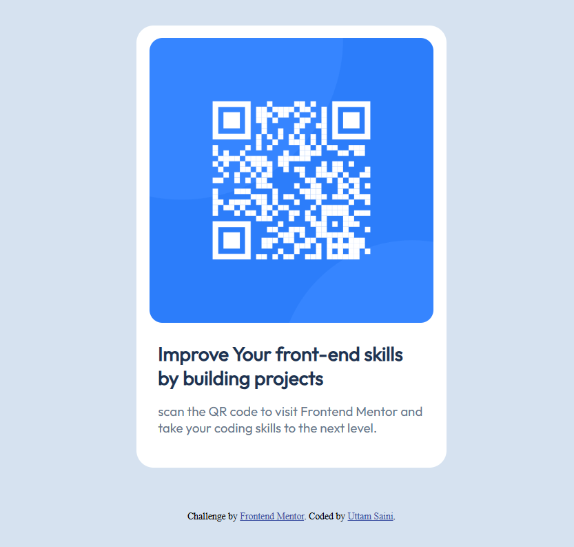

# Frontend Mentor - QR code component solution

This is a solution to the [QR code component challenge on Frontend Mentor](https://www.frontendmentor.io/challenges/qr-code-component-iux_sIO_H). Frontend Mentor challenges help me to improve my coding skills by building realistic projects. 

## Table of contents

- [Overview](#overview)
  - [Screenshot](#screenshot)
  - [Links](#links)
- [My process](#my-process)
  - [Built with](#built-with)
  - [Useful resources](#useful-resources)
- [Author](#author)


## Overview

The goal is to build a single, responsive component that remains centered in the browser regardless of screen size. We are moving away from "stacking blocks" and toward "designing layouts."

### Screenshot




### Links

- Live Site URL: [QR-Code Challange](https://projects-pt2vf1h8w-uttamsaini15s-projects.vercel.app/)

## My process

<details>
<summary><strong>Phase 1: Folder Structure and Content Scan</strong></summary>

1.  **Create a folder with an `index.html` file, a `style.css` file, and an images folder for your QR code graphic.**
2.  **Look at design. We’ll need a container (the card), an image, a heading (h1 or h2), and a paragraph for the description.**
</details>

<details>
<summary><strong>Phase 2: HTML Structure</strong></summary>

1.  **Keep our HTML semantic and clean. You want a single wrapper to hold everything.**
</details>

<details>
<summary><strong>Phase 3: CSS Styling</strong></summary>

1.  **Start by stripping default margins and picking a clean sans-serif font**
2.  **Give the card a white background, rounded corners, and a fixed or max-width.**
3.  **Make sure the image fits perfectly inside the card.**
4.  **Text Alignment**
</details>


### Built with

- Semantic HTML5 markup
- CSS custom properties
- Flexbox
- CSS Grid
- Mobile-first workflow


```html
  <div class="container">
    <div class="card">
      
      <div class="text">
        <h2>Improve Your front-end skills by building projects</h2>
        <p>scan the QR code to visit Frontend Mentor and take your coding skills to the next level.</p>
      </div>
    </div>
  </div>
```
```css
.container{
    max-width: 360px;
    padding-top: 50px;
    padding-bottom: 50px;
    margin: 0 auto;
}

body {
    background-color: hsl(212, 45%, 89%);
    min-height: 100vh;
    align-items: center;
}

.card {
    display: flex;
    flex-direction: column;
    align-content: center;
    border-radius: 20px;
    background-color: white;
    padding: 15px;
}

.text{
    padding: 22px 10px;
    font-size: 15px;
}

img{
    width: 100%;
    border-radius: 15px;
}

h2 {
    font-family: "Outfit", sans-serif;
    font-optical-sizing: auto;
    font-weight: 700;
    font-style: normal;
    color: hsl(218, 44%, 22%);
    margin-bottom: 15px;
}


p{
    font-family: "Outfit", sans-serif;
    font-optical-sizing: auto;
    font-weight: 400;
    font-style: normal;
    color:hsl(216, 15%, 48%);
}

@media (max-width: 375px ) {
    .container {
        margin: 0 1rem;
    }
    
}
```


### Useful resources

- [Google Fonts](https://fonts.google.com/) - This helped me get the targeted fonts. I really liked this and will use it going forward.

## Author

- Website - [Uttam Saini](https://www.linkedin.com/in/uttam-saini-848b66376/)
- Frontend Mentor - [@uttamsaini15](https://www.frontendmentor.io/profile/uttamsaini15)


